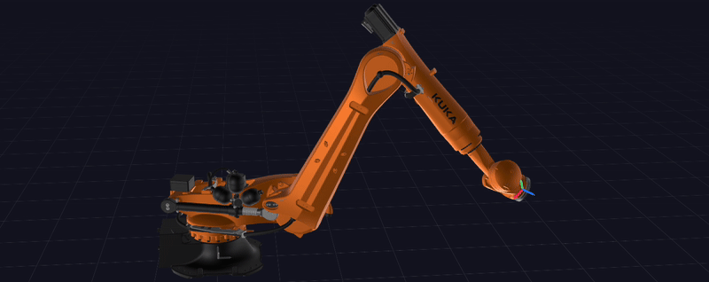

# Stream Target via Jogging API



This setup demonstrates how to **stream Cartesian target positions** to a robot using the **Wandelbots NOVA Jogging API**. As the API currently does not support direct target streaming, we utilize the jogging functionality to achieve this. By starting a motion state stream in parallel to the jogging session, we can derive target velocities and send them to the robot. This is done via a simple P-controller that adjusts the robot's TCP or joint velocity based on the difference between the current state and the desired target.

The implementation includes two variants:

- `src/cartesian.py`: Streams Cartesian target positions.
- `src/joints.py`: Streams joint target positions.

## Setup

1. Make sure you have a NOVA instance running with a (virtual!) motion group configured.
2. Configure the environment variables, eg in a `.env` file based on the `.env.template`.
3. Install dependencies:

```bash
uv sync
```

## Usage

The script starts all necessary connections and streams. It generates random Cartesian target positions within specified bounds. The jogging loop takes care of sending the appropriate TCP velocities to reach these targets.

To run the script, execute:

```bash
uv run src/cartesian.py # For Cartesian target streaming
# or
uv run src/joints.py    # For Joint target streaming
```
